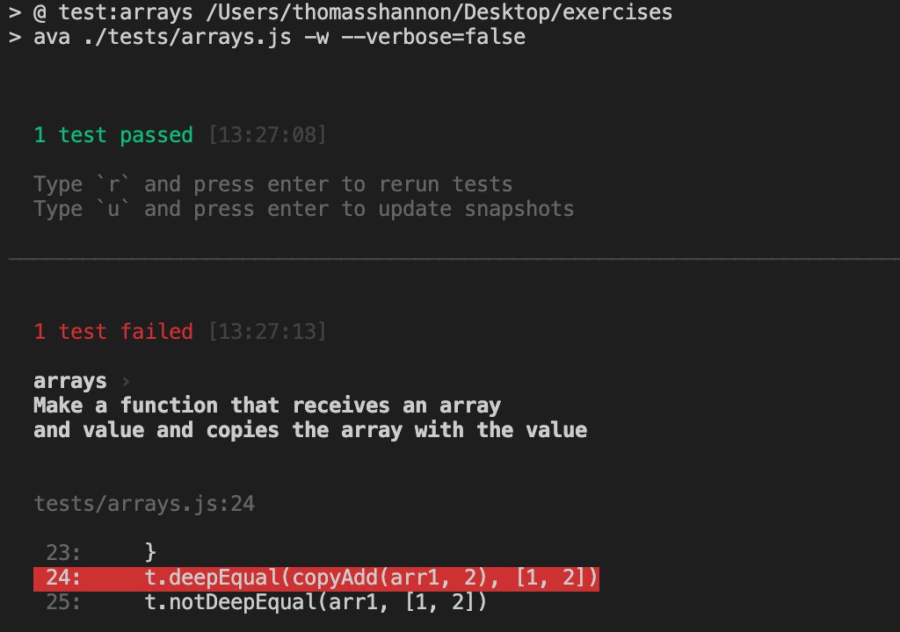

## unit tests using the ava framework

Inside of tests there are a series of tests for arrays, objects, strings, etc

```npm install```


## to test a file (write npm run test:[NAME_OF_FILE])

- these are all included in the package.json

```npm run test:arrays```



### to only run some tests at a time you are working on

- use the only modifier

```test.only('some random test')

### to quit watching your tests

control c (...typed twice...)